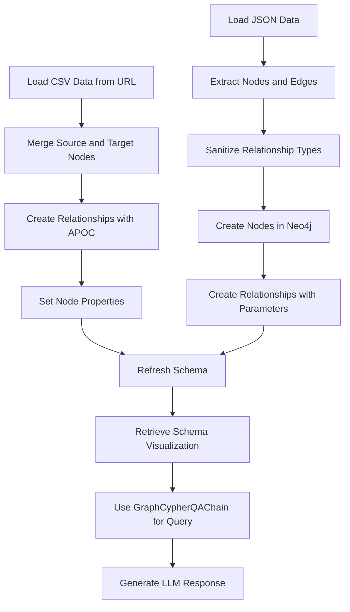

# RAG Framework for PDF and Graph Data Processing
This repository showcases implementations of Retrieval-Augmented Generation (RAG) using LangChain and other frameworks. It includes three use cases to demonstrate knowledge retrieval and management with cutting-edge tools.

## 1. PDF RAG with LangChain
Efficiently processes and queries PDF documents using RAG pipelines.
```mermaid
graph TD
    A[Load PDF Document] --> B[Split Document into Chunks]
    B --> C[Generate Embeddings with HuggingFace]
    C --> D[Store Embeddings in FAISS Vector Store]
    D --> E[Retrieve Relevant Context from FAISS]
    E --> F[Apply Prompt Template]
    F --> G[Run LLM for Question Answering]
    G --> H[Parse and Generate Final Response]
    H --> I[Display the Response]

````


## 2. PDF RAG Without LangChain
A streamlined alternative RAG pipeline without LangChain dependencies.


```mermaid
graph TD
    A[Extract Text from PDF] --> B[Chunk Text into Smaller Segments]
    B --> C[Generate Embeddings with SentenceTransformer]
    C --> D[Create FAISS Index]
    D --> E[Search FAISS for Relevant Chunks]
    E --> F[Combine Relevant Chunks as Context]
    F --> G[Invoke LLM with Context and Query]
    G --> H[Generate and Display Answer]

```


## 3. Graph RAG with LangChain
Integrates Neo4j to build a knowledge graph from structured data.


